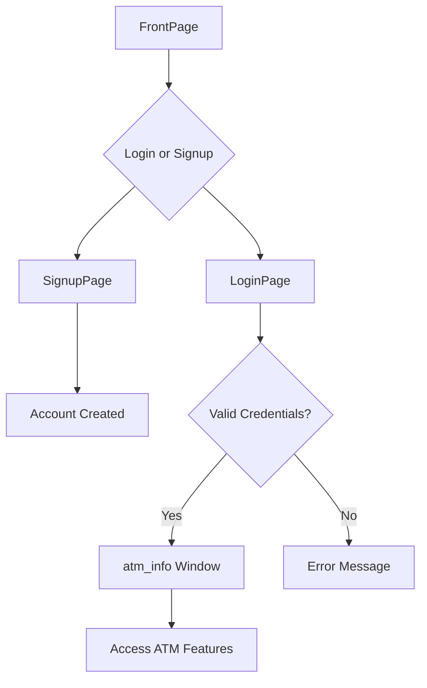

# 💳 ATM System

A desktop-based **ATM Simulation System** built with **Java Swing** and **MySQL**. This application provides users with functionalities similar to a real ATM, including login/signup, balance inquiry, withdrawals, deposits, fast cash, and mini statement viewing.

---

## 🚀 Features

- 🔐 **User Authentication**\
  Users can sign up with their personal details and securely log in to the system.

- 💰 **Balance Inquiry**\
  Displays the current account balance of the user.

- 💸 **Withdrawal**\
  Allows users to withdraw a custom amount, with validation for sufficient balance.

- 💵 **Deposit**\
  Enables users to deposit money into their account.

- ⚡ **Fast Cash**\
  Quick cash withdrawal options (Tk. 500, Tk. 1000, Tk. 5000).

- 📄 **Mini Statement**\
  View recent transactions for quick reference.

---

## 🛠️ Tech Stack

- **Java (Swing)** – for GUI
- **MySQL** – for backend database
- **JDBC** – for database connectivity

---

## 📆 Prerequisites

Ensure you have the following installed:

- ✅ [Java JDK](https://www.oracle.com/java/technologies/javase-downloads.html)
- ✅ [MySQL Server](https://dev.mysql.com/downloads/mysql/)
- ✅ [MySQL Connector/J](https://dev.mysql.com/downloads/connector/j/) (JDBC driver)

---

## 🗃️ Database Setup

1. **Create Database**

   ```sql
   CREATE DATABASE `db u`;
   ```

2. **Create **``** Table**

   ```sql
   CREATE TABLE users (
     username VARCHAR(255) NOT NULL,
     password VARCHAR(255) NOT NULL,
     PRIMARY KEY (username)
   );
   ```

3. **Create **``** Table**

   ```sql
   CREATE TABLE singup (
     Name VARCHAR(255),
     Phone VARCHAR(255),
     Username VARCHAR(255) NOT NULL,
     Email VARCHAR(255),
     Password VARCHAR(255),
     PRIMARY KEY (Username)
   );
   ```

---

## ⚙️ How to Run the Application

1. **Configure Database Connection**

   - Navigate to `src/source/sqlConnection.java`
   - Update the DB connection credentials:
     ```java
     String url = "jdbc:mysql://localhost:3306/db u";
     String user = "root";       // replace with your MySQL username
     String pass = "";           // replace with your MySQL password
     ```

2. **Compile and Run**

   - Compile all `.java` files:
     ```bash
     javac src/source/*.java
     ```
   - Run the application:
     ```bash
     java src/source/FrontPage
     ```

---

## 🧯 Application Flow



---

## 📂 Project Structure

```
/ATM-System
├── src/
│   └── source/
│       ├── FrontPage.java
│       ├── LoginPage.java
│       ├── SignupPage.java
│       ├── atm_info.java
│       └── sqlConnection.java
├── README.md
└── database/
    └── db u.sql (optional)
```

---

## 🔐 Security Notes

- Passwords are stored as plaintext in the current version. For real-world use, consider hashing (e.g., BCrypt).
- No form validation is present; input sanitization is recommended.

---

## 📌 TODO (Optional Enhancements)

-

---

## 📧 Contact

**Author**: Mehedi Hasan Rohan\
**Email**: [mehedihasanrohan07@gmail.com](mailto\:mehedihasanrohan07@gmail.com)

Feel free to fork the repo, give it a ⭐, or suggest improvements via issues or pull requests!

